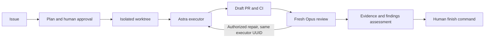

# Agentic development in FLOW-DC

FLOW-DC uses an issue, an approved plan and an isolated worktree for each managed task. A dedicated OpenAI executor implements and repairs the change. A fresh GitHub Copilot session reviews the committed PR. The maintainer makes the merge decision.



## Start here

| Need | Read |
| --- | --- |
| Set up this checkout, accounts and checks | [Setup](SETUP.md) |
| Ask an agent to manage a task or resume one | [Eight workflow skills](SKILLS.md) |
| Understand each lifecycle step | [Operating guide](OPERATING-GUIDE.md) |
| Review limits, independence and findings | [Review procedure](REVIEW.md) |
| Merge, preserve artifacts or recover cleanup | [Human finish](FINISH.md) |
| Assess downloader or research changes | [FLOW-DC domain rubric](domain-review.md) |
| Understand the sources and local adaptations | [Research](RESEARCH.md) and [traceability](TRACEABILITY.md) |
| See what has actually been exercised | [Verification record](VERIFICATION.md) |

After setup, open Codex in the clean control checkout and invoke:

```text
$agentic-workflow Implement FLOW-DC issue #123 using its approved plan.
```

Use a real issue number. The eight repository skills are installed under `.agents/skills/`; no global skill installation is needed. If a running Codex session does not discover newly installed skills, start a new session in the updated repository.

## Project defaults

- Executor and other nonreview roles: `gpt-6-astra`.
- Reviewer: Copilot `claude-opus-5`, fresh session, static inspection only.
- Review budget: one attempted round, 400 AI credits, 900 seconds. Extra rounds follow the [continuation policy](REVIEW.md#model-selection-and-repair).
- Review diff: unlimited by default; a positive `max_diff_bytes` opts into a cap.
- Managed executor prompt: separate 300000-byte limit.
- Required CI: `flowdc-tests` and `agentic-quality`.
- Hosted review: installed but disabled until explicitly onboarded.
- Private context: ignored `memory/`; machine continuity and artifacts: ignored `.agentic-local/` in the control checkout.

Configuration is in [`.agentic/config.json`](../../.agentic/config.json). Neither CI nor model review establishes scientific validity. Apply the repository's [agent notes](../../AGENTS.md) and domain rubric to the actual change.
